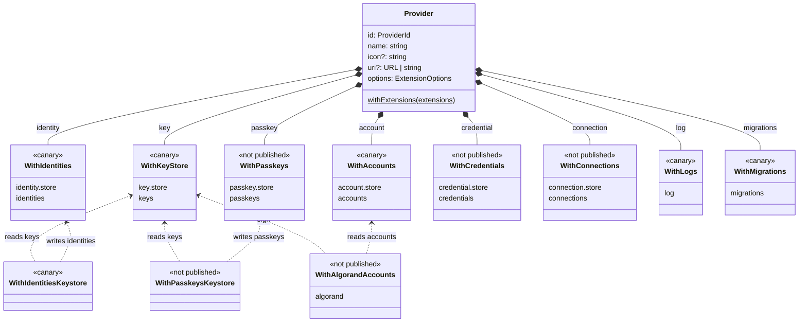

# Discovery Document

This document describes the high level architecture of wallet core functionality.

The core `Provider` carries only `ProviderOptions` (`id`, `name`, `icon`, `uri`, `port`, `ssl`) and
`withExtensions`. Every capability is a `With<Domain>` extension, and a composed provider is the
sum of the extensions it was built from: each one mounts its `<singular>` namespace and its
reactive `<plural>` list on the provider. The diagram shows that composition for the real
extension packages in `wallet-provider-extensions`. Dashed edges are **bridges**: extensions that
read one domain's store and write (or extend) another.



What the diagram asserts, and what the rest of this document spells out:

- **One domain, one store.** Every surface mounted under a domain (`provider.key.store`, a
  Vault or Ledger surface, a bridge that writes keys) takes the same `options.<plural>.store`.
  `provider.<plural>` is the domain's single reactive list. See
  [One domain, one store](#one-domain-one-store).
- **Bridges return `{}` or extend a namespace, never replace one.** `WithAccountsKeystore`
  reads `options.keystore.store`, derives accounts whose `sign` delegates to
  `provider.key.store.sign`, writes them into `options.accounts.store` under
  `walletKey ?? provider.id`, and returns `{}`. It is a **reference example, not for
  production**: it ships no chain address scheme and keys each account by the base64 public
  key. `WithAlgorandAccounts` is the production bridge; it owns Algorand and Falcon-1024
  addressing and additionally mounts `provider.algorand`; the connections bridges mount
  `provider.<singular>.remote`; the Intermezzo bridges mount `provider.<singular>.intermezzo`.
  All of them use `extendNamespace` for what they mount and write only to their target
  domain's store.
- **Order is the caller's job.** `withExtensions([WithKeyStore, WithAccounts, WithAccountsKeystore, WithAlgorandAccounts])`;
  a dependent probes `provider.key?.store` (or `options.accounts?.store`) and throws when it
  is missing. See [Depending on another extension](#depending-on-another-extension).
- **Nested account state.** `AccountStoreState` is `{ wallets: { [walletKey]: { accounts, activeAccount } }, activeWallet }`
  and `walletKey` defaults to `provider.id`, so one store instance can serve several providers
  and `@txnlab/use-wallet` at once. `provider.accounts` reads `wallets[walletKey]?.accounts`.
- **Infrastructure namespaces are the exception.** `WithLogs` (`options.log` → `provider.log`)
  and `WithMigrations` (`options.migrations` → `provider.migrations`) expose their API
  directly, without a `.store` level; they are not domains and hold no per-domain list.
- **Registries.** The names on the arrows above are typed through two declaration-merged
  registries: every package augments `ExtensionOptions` with its `options.<plural>` slice, and
  the `Namespaces` registry in `src/namespace.ts` is the target convention for the provider
  side. The published canaries have not yet adopted `Namespaces` and type their provider
  surface through the extension's own API type instead.

Publication status, for the labels above: `canary` = `1.0.0-canary.N` on npm
(`@algorandfoundation/keystore`, `accounts-core` (legacy published name `accounts-store`),
`accounts-keystore-extension`, `identities-core`, `identities-keystore-extension`, `logs`,
`provider-migrations`); everything else, including the `@algorandfoundation/accounts`
meta package, is `not published` and may change shape.

## Options registry and namespace resolution

The `Provider` shape above is assembled from extensions. Each extension package registers its
fixed provider namespace and its options namespace through declaration merging:

1. **A provider namespace** in the shared `Namespaces` registry, such as `provider.key`.
2. **An options namespace** in the shared `ExtensionOptions` registry, such as
   `options.keystore`.

The package owns the provider name. Applications do not rename it, and an unregistered name
is a TypeScript error. The options registry remains the single typed bag passed to extensions.
The base `class X extends Provider` constructor stays untyped on purpose so concrete wallets can
own their option shape.

The naming convention is the same on both sides of every extension: the extension is
`With<DomainPlural>`, its configuration lives at `options.<plural>`, its API lives at
`provider.<singular>.store`, and its reactive state reads at `provider.<plural>`
(`WithKeyStore` → `options.keystore` → `provider.key.store` + `provider.keys`). The
[tutorial](./TUTORIAL.md#3-domain-stores--injected-reactive-state) explains why the symmetry
matters; this document covers the mechanics.

### Registering a namespace

Register the provider namespace once in the package that owns the domain. Use the extension's
existing API type as the registry value. Other packages can contribute fields to that type, but
they do not register the name again:

```typescript
import type { ExtensionOptions, Namespaces } from "@algorandfoundation/wallet-provider";

export interface KeyStoreExtension {
  key: KeyStoreAPI;
}

declare module "@algorandfoundation/wallet-provider" {
  interface Namespaces {
    key: KeyStoreExtension["key"];
  }

  interface ExtensionOptions {
    keystore?: KeyStoreOptions;
  }
}
```

Keep the options namespace optional so providers composed without the extension still type-check.
An extension's own options type may require its store. The provider namespace is fixed even when
several extensions contribute to it.

Registering types both parameters of every `Extension`. The signature is
`(provider: NamespaceHost, options: ExtensionOptions) => T`, where `NamespaceHost` is
`Provider & Partial<Namespaces>`, so `provider.key` reads as `Namespaces["key"] | undefined`
and `options.keystore?.store` as the registered store type. There is no resolver helper: a
typo such as `provider.keys` or `options.keystores` is a compile error, and no parameter
annotation is needed.

### Extending a namespace

Extensions return only what they contribute. `extendNamespace` copies the existing group,
merges the supplied object, and rejects a contribution that overwrites a leaf. This keeps the
first extension's surface and lets later extensions add sibling or nested fields:

```typescript
import { extendNamespace, type Extension } from "@algorandfoundation/wallet-provider";

export const WithKeyStore: Extension<KeyStoreExtension> = (provider, options) => {
  const store = options.keystore?.store;
  if (!store) throw new Error("WithKeyStore requires options.keystore.store");
  const keyStore = createKeyStore({ ...options.keystore, store });
  return {
    ...extendNamespace(provider, "key", { store: keyStore }),
    get keys() {
      return store.state.keys;
    },
  };
};

// Use Vault instead of the local implementation when the store surface is remote.
export const WithVaultKeyStore: Extension<KeyStoreExtension> = (provider, options) => {
  const store = options.keystore?.store;
  if (!store) throw new Error("WithVaultKeyStore requires options.keystore.store");
  const vault = createVaultKeyStore({ store, ...options.vault });
  return {
    ...extendNamespace(provider, "key", { store: vault }),
    get keys() {
      return store.state.keys;
    },
  };
};

export const WithLedgerKeyStore: Extension<object> = (provider, options) => {
  const store = options.keystore?.store;
  if (!store) throw new Error("WithLedgerKeyStore requires options.keystore.store");
  const ledger = createLedgerKeyStore({ store, owner: pkg.name, ...options.ledger });
  return extendNamespace(provider, "key", { hardware: { ledger } });
};

// An extension can extend more than one registered namespace.
export const WithLedgerAccounts: Extension<object> = (provider, options) => {
  const ledger = createLedgerKeyStore({ store: options.keystore.store, owner: pkg.name });
  return {
    ...extendNamespace(provider, "key", { hardware: { ledger } }),
    ...extendNamespace(provider, "account", { hardware: { ledger } }),
  };
};

Provider.withExtensions([WithKeyStore, WithLedgerKeyStore, WithTrezorKeyStore]);
// provider.key === { store: local, hardware: { ledger, trezor } }
// provider.keys === options.keystore.store.state.keys
```

Use `WithVaultKeyStore` instead of `WithKeyStore` when Vault owns `key.store`. Ledger and
Trezor can still extend the same `key` namespace. A getter contributed by the first extension
stays live because later contributions merge beside it.

#### One domain, one store

A namespace separates API surfaces, never state. Every surface contributed under a domain's
namespace (the keystore and each hardware device) takes the same store from
the domain's options slice (`options.keystore?.store`, typed by the `ExtensionOptions`
registry) and writes into it. `provider.keys` must be the list of every key the wallet can use,
whoever holds it. A wallet backed by Vault with a Ledger and a Trezor attached has one key
list, not three.

A Vault or hardware keystore is therefore a **bridge** (see
[Extensions that expose no API](#extensions-that-expose-no-api)): it subscribes to another
party and reconciles that party's keys into the domain store, the same way the accounts
bridge reconciles keys into accounts. Only the source of the side effects differs: a Vault
server, a USB device or a secure element instead of a local derivation. The bridge rules
apply: hydrate from the party's current snapshot, subscribe, commit each change in one
`setState`, and write only to the keystore domain's store.

A per-surface store (`options.ledger.store`) splits the list and is wrong. The party's options
block carries only what is specific to that party: a Vault address, Transit endpoint and auth
method; a device transport; a Seed Vault authorization. Never a store.

Two rules follow from sharing the store:

- **Tag what you write.** Each entry an extension writes carries the name of the package that
  wrote it (`Owned`: `{ ..., owner: pkg.name }`, with
  `import pkg from "../package.json" with { type: "json" }`). The tag is required; the local
  keystore tags its entries like every other writer. The owning package filters them with
  `ownedBy(pkg.name)`.
- **Augment the API on the party's surface.** Some operations exist only for one party: a
  Vault `login()` or token renewal, a Ledger `connect()`, a Seed Vault authorization. They
  do not belong on the common `KeyStoreAPI`; they live on the party's own surface,
  `provider.key.hardware.ledger.connect()`. When Vault is `key.store`, that surface is the
  Vault API and `login()` sits there, but consumers depend on `KeyStoreAPI` (`sign`,
  `verify`, ...), which every surface exposes. `login` and friends are additions, not
  replacements.

#### Two paths to one operation

A key written by the Ledger extension can only be signed by that extension. Consumers reach
the operation two ways, and both use the hydrated operation on the key entry:

| Path              | Provided by              | When                                                   |
| ----------------- | ------------------------ | ------------------------------------------------------ |
| `key.sign(bytes)` | the hydrated key entry   | hydrated on every store change                         |
| call by id        | the common key store API | finds the entry by id and calls its attached operation |

The instance path is for callers that hold a key, or an account derived from one. The
accounts bridge already works this way: accounts are a reflection of keys, and the signer is
re-attached in memory. The store path is for callers that only have an id.

Hydration is a store subscription. Each package picks the entries it owns (`ownedBy(pkg.name)`)
and attaches its operations (`hydrate`). The local keystore hydrates its own entries the same
way, so every owner follows one rule. The functions are non-enumerable, so the store keeps
holding data: `JSON.stringify`, `structuredClone` and the Chrome storage bridge drop them
instead of pushing them to another party. The call skips operations that are already there,
so it is safe to run on every emit and re-attaches after a bridge replaces the array.

The entry type declares its operations as optional properties filled by hydration, so a read
needs no cast and reflects that an entry may not be hydrated yet:

```typescript
interface Key extends Owned {
  id: string;
  sign?: (bytes: Uint8Array) => Promise<Uint8Array>; // attached by the owner's hydration
}
```

```typescript
import pkg from "../package.json" with { type: "json" };

export const WithLedgerKeyStore: Extension<object> = (provider, options) => {
  const store = options.keystore?.store;
  if (!store) throw new Error("WithLedgerKeyStore requires options.keystore.store");
  const ledger = createLedgerKeyStore({ store, owner: pkg.name, ...options.ledger });

  store.subscribe((state) => {
    if (state.status !== "ready") return;
    for (const key of state.keys.filter(ownedBy(pkg.name))) {
      hydrate(key, {
        sign: (bytes: Uint8Array) => ledger.sign(key.id, bytes), // prompts on the device
        verify: (bytes: Uint8Array, sig: Uint8Array) => ledger.verify(key.id, bytes, sig),
      });
    }
  });

  return extendNamespace(provider, "key", { hardware: { ledger } });
};
```

The common key store never signs on behalf of another extension. A call by id finds the entry
and calls its attached operation. A key whose owner has not hydrated it stays data-only, and
the call throws a `MountError`.

```typescript
async sign(id: string, bytes: Uint8Array) {
  const key = store.state.keys.find((k) => k.id === id);
  if (!key) throw new KeyNotFoundError(id);
  if (!key.sign) throw new MountError(`key ${id} has no signer: its owner has not hydrated it`);
  return key.sign(bytes);
}
```

One writer per key: the package named by `owner` is the only one that writes or hydrates that
entry. `ownedBy` is an exact match on the package name, so two packages can never claim each
other's keys and there is no reserved default.

#### Depending on another extension

Extensions apply in order and receive the live instance, so a dependent extension reads its
dependency while it is being built. `provider.key` is typed `Namespaces["key"] | undefined`
by the `Extension` signature, so a missing dependency can fail with a useful construction
error. The example follows the shape of the reference bridge `WithAccountsKeystore`; a
production bridge such as `WithAlgorandAccounts` differs only in what `deriveAccount` does
(it derives a real chain address instead of a base64 public key):

```typescript
import { MountError, type Extension } from "@algorandfoundation/wallet-provider";

export const WithAccountsKeystore: Extension<object> = (provider, options) => {
  const keys = options.keystore?.store;
  const accounts = options.accounts?.store;
  if (!provider.key?.store || !keys) throw new Error("WithAccountsKeystore needs WithKeyStore");
  if (!accounts) throw new Error("WithAccountsKeystore needs options.accounts.store");
  const walletKey = options.accounts?.walletKey ?? provider.id;

  const reconcile = () => {
    if (keys.state.status !== "ready") return;
    const derived = keys.state.keys.map((entry) => ({
      ...deriveAccount(entry),
      sign: (bytes: Uint8Array) => {
        if (!entry.sign) throw new MountError(`key ${entry.id} is not hydrated`);
        return entry.sign(bytes);
      },
    }));
    accounts.setState((state) => {
      const current = state.wallets[walletKey] ?? { accounts: [], activeAccount: null };
      return {
        ...state,
        wallets: { ...state.wallets, [walletKey]: { ...current, accounts: derived } },
      };
    });
  };

  reconcile(); // hydrate from the current snapshot
  keys.subscribe(reconcile); // then reconcile on every change
  return {}; // the accounts store is the interface; provider.accounts reflects the writes
};
```

Ordering is still the caller's job
(`withExtensions([WithKeyStore, WithAccounts, WithAccountsKeystore])`). A wrong order now
fails at construction with a clear error instead of `undefined.sign` later.

### Rules that keep extensions composable

Hold your extension to these and it will compose cleanly with everything else in the
ecosystem. The reasoning behind each rule is in the
[tutorial](./TUTORIAL.md#for-extension-authors-implementing-a-capability); the list here is
the checklist.

- **Take your store from your options namespace, never create private ones.** A store hidden
  inside a closure cannot be persisted, tested, or observed from outside.
- **One domain, one store.** Every surface contributed under a namespace (local, Vault, Ledger)
  reads the same `options.<domain>.store` and feeds it, so
  `provider.<plural>` is the domain's single list. Tag what you write with your package name
  (`Owned`: `owner: pkg.name`) and put party-specific operations (`key.hardware.ledger.connect`)
  on your own surface, not on the common API.
- **Hydrate only what you own.** Attach operations to entries with `hydrate` inside a store
  subscription, filtered by `ownedBy(pkg.name)`. Never attach
  to another extension's entries. `<namespace>.store` looks up an entry by id and calls its
  attached operation.
- **One domain, one namespace, on both sides.** Read configuration from `options.<plural>`
  (e.g. `options.accounts`) and return your API under the singular key, so it lands at
  `provider.<singular>.store` (e.g. `provider.account.store`) next to the reactive
  `provider.<plural>` getter.
- **Return only what you contribute.** Never `return { ...provider, ... }`: the provider merges
  your object's _own property descriptors_ (`Object.getOwnPropertyDescriptors`), so spreading
  the provider copies its reactive getters as frozen values. To add a surface to a namespace
  another extension already claimed (`provider.key`), use `extendNamespace` instead of
  returning a fresh `key` object that shadows the earlier one.
- **Stay synchronous.** Extensions are applied in the constructor; returning a Promise
  throws a `TypeError`. Kick off async work inside a method (or expose a `ready` promise on
  your API) instead of making the extension itself `async`.
- **Named exports only.** Export `With<DomainPlural>` by name; extension packages ship no
  default exports.
- **Write only to your own domain's store.** Reading other domains' stores is fine; writing
  to them is another extension's job.
- **Effect first, mutation last.** Perform the side effect (network call, deep link,
  keychain access), then commit the outcome in one `setState`.
- **Extensions apply in order.** If you depend on the API of another extension, document the
  required ordering: `withExtensions([WithKeyStore, WithAccounts, WithAccountsKeystore])` gives `WithAccountsKeystore` access to
  everything `WithKeyStore` and `WithAccounts` contributed. Probe it with a plain read (`provider.key?.store`) and
  throw when it is missing.

### Extensions that expose no API

Not every extension returns methods. A **bridge** subscribes to one store and feeds another;
see [Bridges: routing keys by role](./ARCHITECTURE.md#bridges-routing-keys-by-role) for
where they sit in the flow. For example, a watcher that routes identity-context keys from
the keystore into an identities store:

```typescript
import type { Extension } from "@algorandfoundation/wallet-provider";

export const WithIdentityWatcher: Extension<object> = (provider, options) => {
  const keys = options.keystore.store;
  const identities = options.identities.store;

  keys.subscribe(() => {
    const identityKeys = keys.state.keys.filter((k) => k.metadata?.context === 1);
    identities.setState(() => ({
      identities: identityKeys.map((k) => createKeyIdentity(k)),
    }));
  });

  return {}; // nothing merged; the store mutations are the whole capability
};
```

Nobody ever calls a method on this extension, yet every subscriber of the identities store
reacts to its writes. The store is the interface. Because such an extension contributes no
provider surface, there is no `provider.<namespace>` to read for it. Probe the store it writes
to instead.

A hardware or Vault keystore is the same shape with two differences: its side effects come
from another party, and it extends a namespace with what the common API cannot offer
(`key.hardware.ledger.connect`, `key.store.login` on Vault). Its keys still land in the
keystore domain's one store; see [One domain, one store](#one-domain-one-store). A bridge to
another provider's keystore is a separate connections capability.
