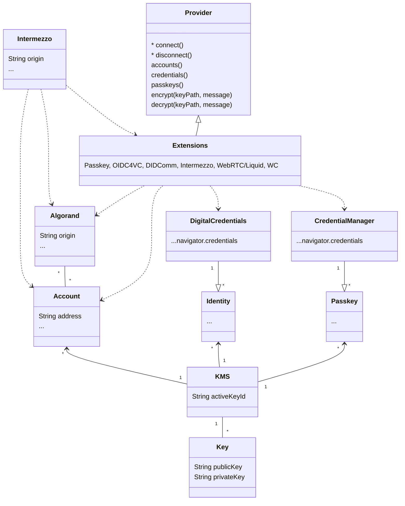

# Discovery Document

This document describes the high level architecture of wallet core functionality.

```mermaid
classDiagram
    KMS  "1" -- "*" Key
    Account "*" <-- "1" KMS
    Identity "*" <-- "1" KMS
    Passkey "*" <-- "1" KMS
    
    
    Intermezzo ..> Account
    Intermezzo ..> Algorand
    Intermezzo ..> Extensions
    
    Algorand "*" -- "*" Account

    DigitalCredentials "1" --|> "*" Identity
    CredentialManager "1" --|> "*" Passkey
    
    Provider <|-- Extensions
    
    %% Adopt incrementally to form 
    Extensions ..> CredentialManager
    Extensions ..> DigitalCredentials
    Extensions ..> Algorand
    Extensions ..> Account

    %% Generic Provider wrapper
    class Provider {
        %% TBD: High level wrapper for interacting with services. ARC27 UseWallet BaseWallet?
        * connect()
        * disconnect()
        
        %% Proviers can be used to manage accounts, traditional use-wallet provider role
        accounts()
        
        %% Providers can be used to manage identities, this a new introduction
        credentials()
        %% Providers can be used to manage passkeys, this a new introduction
        passkeys()
        
        %% Cryptographic operations, exposed from the KMS
        encrypt(keyPath, message)
        decrypt(keyPath, message)
    }
    
    class Account {
      %% Algosdk v10 Account Manager
      String address
      ...
    }
    class Key {
      %% TBD - Algosdk v10 Key Manager?, XHD?
      String publicKey
      String privateKey  
    }
    class KMS {
        %% TBD - Pera/Wallet Core? Algosdk v10 Key Manager, XHD?
        %% possibly use WebCrypto api and polyfill when possible
        String activeKeyId
    }
    class Identity {
        %% Abstration around identity and DigitalCredential API
        %% TBD - Algo/Intermezzo Identity Manager? Liquid Auth?
        %% TODO: large explainer on ephemerial keys and how they are used in DIDComm/etc
        ...
    }
    class Passkey{
        %% CredentialManager API currently via Liquid Auth and Pera
        %% There is current a distinction between a Passkey and a DigitalCredential
        ...
    }
    class Extensions {
        %% Contribute to use-wallet with native support and consolidation of all efforts
        %% This would encompass any additional ecosystem integrations like react
        Passkey, OIDC4VC, DIDComm, Intermezzo, WebRTC/Liquid, WC
    }
    class Algorand {
        %% use-algorand wrapper for Algosdk v10
        String origin
        ...
    }
    class Intermezzo {
        %% Intermezzo Example for extending the ecosystem
        String origin
        ...
    }
    class DigitalCredentials {
        %% Provided by platforms
        ...navigator.credentials
    }
    class CredentialManager {
        %% Provided by platforms
        ...navigator.credentials
    }
    
    
```
